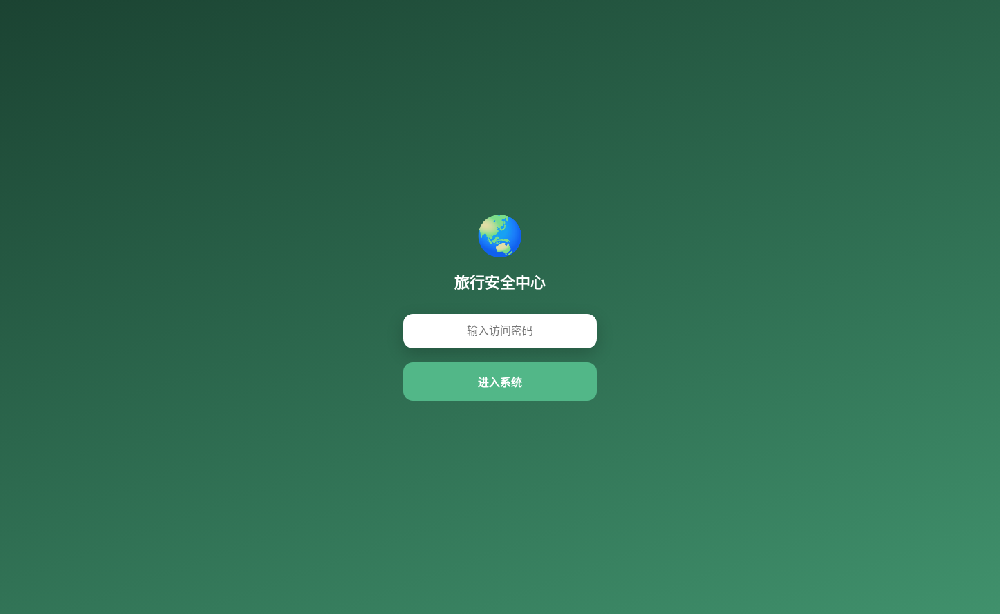
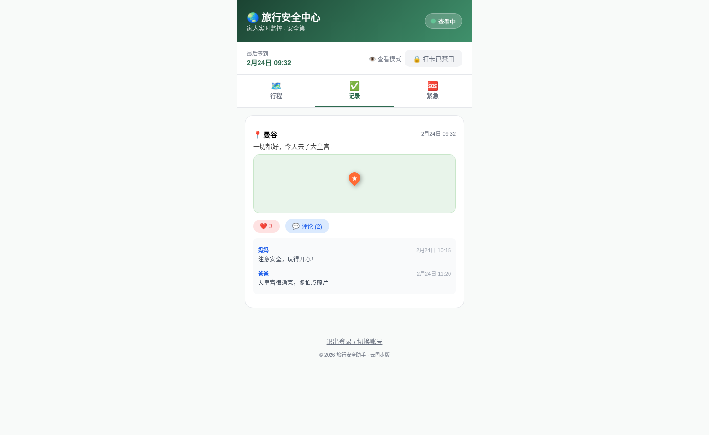
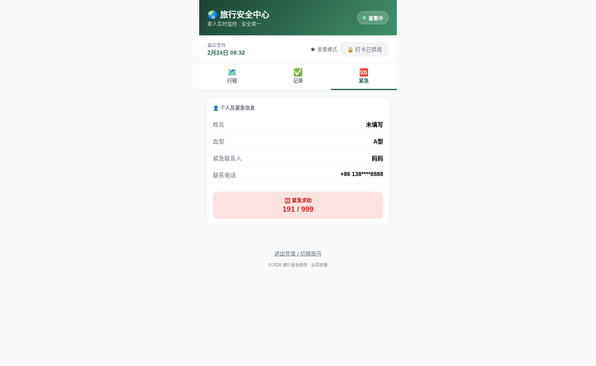
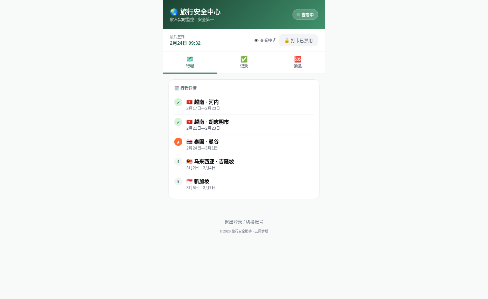
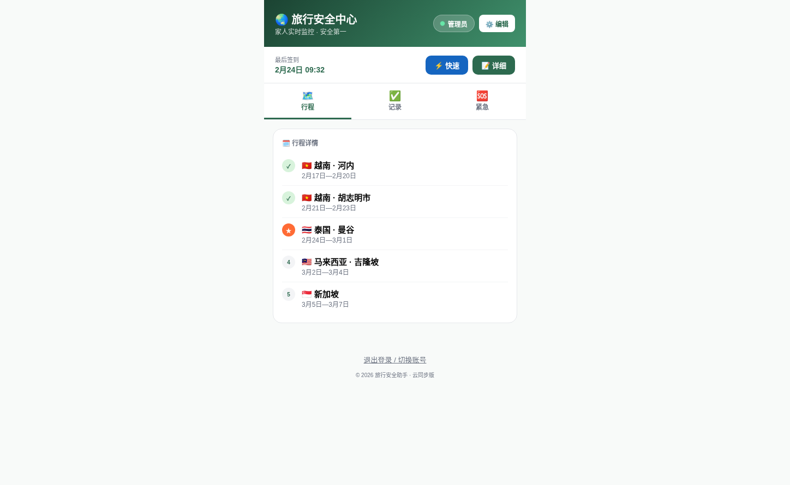
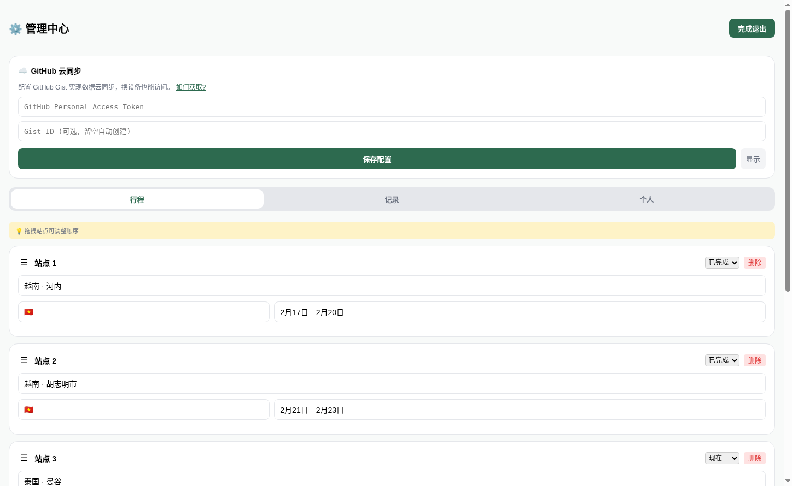
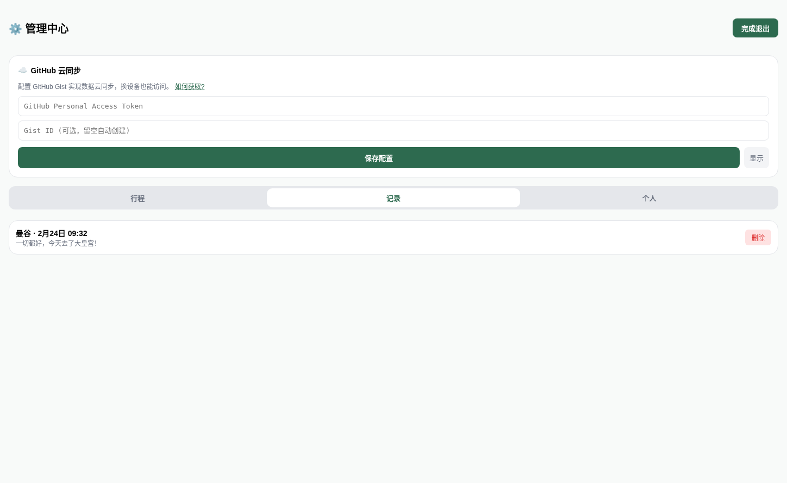
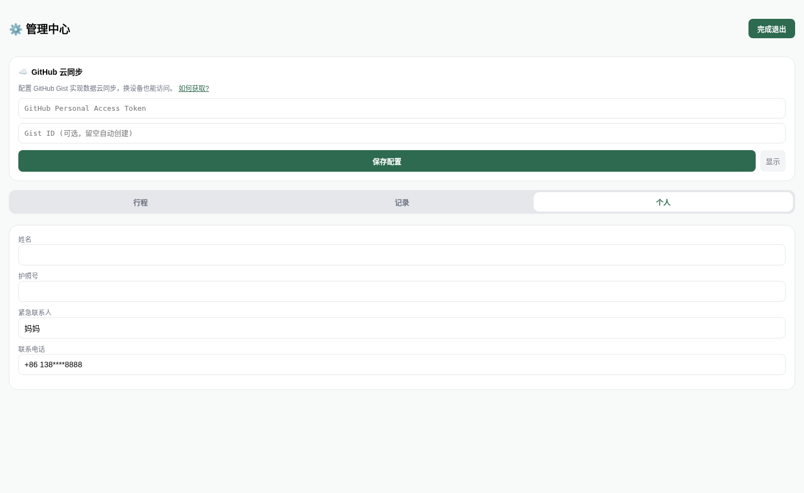
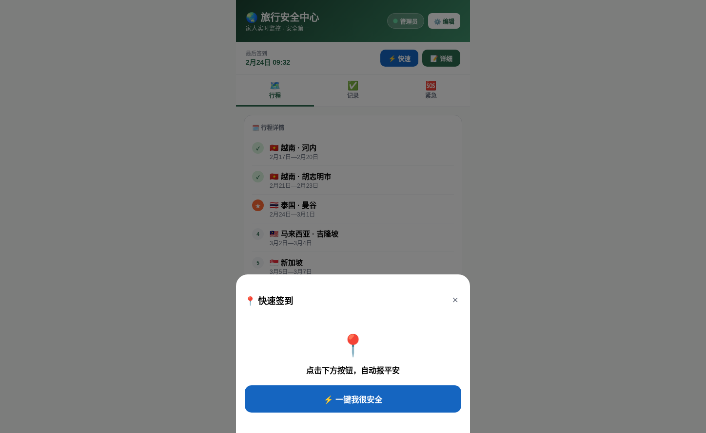
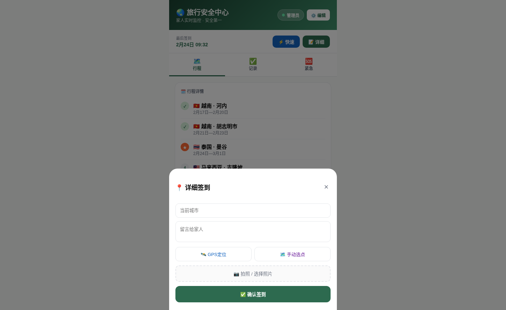

# 🌏 Travel Safety - 旅行安全中心

> 简明易懂的产品介绍

---

## 产品定位

**一款让家人随时了解你旅行状态的轻量级工具** —— 旅行者通过定期"签到"报平安，家人通过专属密码查看行程和状态，无需复杂注册，数据完全由自己掌控。

---

## 核心功能

### 1. 📍 签到打卡
- **快速签到**：一键发送"我很安全"状态
- **详细签到**：填写当前位置、留言、拍照、GPS定位
- 签到记录自动展示在"记录"页面

### 2. 🗺️ 行程管理
- 按时间线展示旅行站点（已完成 → 正在进行 → 即将前往）
- 支持拖拽调整站点顺序
- 每个站点可查看地图位置

### 3. 👨‍👩‍👧 家人互动
- 家人使用查看密码登录，只能浏览、点赞、评论
- 无法修改行程或发布签到
- 评论实时显示，增强家人间的互动

### 4. 🆘 紧急信息
- 集中展示血型、紧急联系人电话等关键信息
- 方便在紧急情况下快速查阅

### 5. ☁️ 云同步（可选）
- 配置 GitHub Gist 即可实现数据云端备份
- 换设备也能访问完整数据
- 无需自建服务器，完全免费

---

## 使用场景

| 场景 | 解决的问题 |
|------|------------|
| 独自出境旅行 | 让父母随时知道你在哪、是否安全 |
| 多国深度游 | 清晰展示行程路线，便于家人了解你的动向 |
| 长途旅行 | 减少家人反复询问"到哪了"的沟通成本 |
| 突发状况 | 紧急联系人信息一目了然 |

---

## 产品截图

### 1. 登录页面

简洁的密码输入界面，支持两种角色：
- **travel2026**：家人/朋友查看模式
- **admin888**：管理员编辑模式

### 2. 查看模式首页

家人登录后看到的主界面：
- 顶部显示当前状态（查看中）
- 签到条显示最后一次签到时间
- 三个标签页：行程 / 记录 / 紧急

### 3. 签到记录

展示旅行者的每次签到：
- 位置、时间、留言内容
- 家人可点赞、评论互动

### 4. 紧急信息

关键时刻的重要信息：
- 血型、紧急联系人
- 联系方式一目了然

### 5. 行程页面

展示完整旅行路线：
- 当前所在地突出显示
- 已完成站点用 ✓ 标记
- 显示地图位置

### 6. 管理员模式

旅行者登录后可使用：
- ⚙️ 编辑：管理行程和个人信息
- ⚡ 快速：快速签到
- 📝 详细：带定位和照片的详细签到

### 7. 编辑行程

管理员专属功能：
- 添加/编辑/删除旅行站点
- 拖拽调整站点顺序
- 设置站点状态（已完成/现在/计划）

### 8. 编辑签到记录

管理所有签到记录：
- 查看、编辑、删除签到
- 修改留言内容

### 9. 编辑个人信息

设置紧急联系信息：
- 血型、紧急联系人电话
- 这些信息会显示在"紧急"页面

### 10. 快速签到

一键报平安：
- 点击按钮立即发送"我很安全"状态
- 适合快速告知家人自己平安

### 11. 详细签到

更详细的签到方式：
- 填写当前位置
- 添加留言
- 支持GPS定位和照片

---

## 技术亮点

| 特点 | 说明 |
|------|------|
| **极简架构** | 单HTML文件 + React，无需构建，直接运行 |
| **存储方案** | localStorage本地存储 + GitHub Gist云同步 |
| **安全设计** | 双密码体系，查看/编辑权限分离 |
| **离线友好** | 数据存本地，断网也能查看历史记录 |
| **开源免费** | 代码完全开源，数据自己掌控 |

---

## 使用方式

1. 访问网站：https://dongwu233.github.io/travel-safety/
2. 输入密码登录
   - 家人/朋友输入：`travel2026`（只能查看）
   - 管理员输入：`admin888`（可编辑）
3. 管理员模式下点击右上角"编辑"按钮管理行程
4. 定期签到，让家人了解你的状态

---

## 适用人群

✅ 独自旅行的年轻人，想让父母放心
✅ 境外深度游，行程复杂多变
✅ 注重隐私，不想用社交平台报平安
✅ 技术爱好者，喜欢自己掌控数据

---

© 2026 旅行安全助手·云同步版
